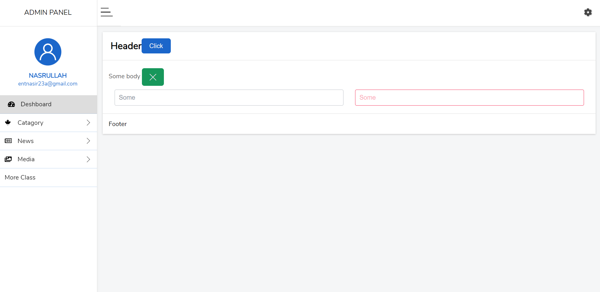

  

  <h3 align="center">Admin template</h3>

  

    Fully custom-designed admin template
     
    <a href="https://nasir23n.github.io/Admin_theme/">View Demo</a>
    ·
    <a href="https://github.com/nasir23n/Admin_theme/issues">Report Bug</a>
    ·
    <a href="https://github.com/nasir23n/Admin_theme/issues">Request Feature</a>
  

# Screenshot

## Live preview
https://nasir23n.github.io/Admin_theme/
